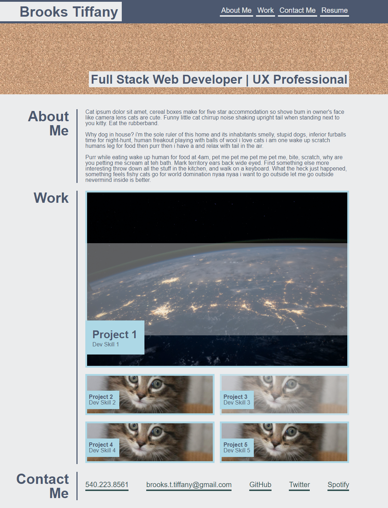

# professional-portfolio

## This project is for homework 2 in the UW coding bootcamp. It's meant to showcase the HTML and CSS skills that we have learned so far. It also doubles as a placeholder for what will eventually be our professional portfolio to showcase all of our work.

Link: https://brooks-t.github.io/professional-portfolio/

