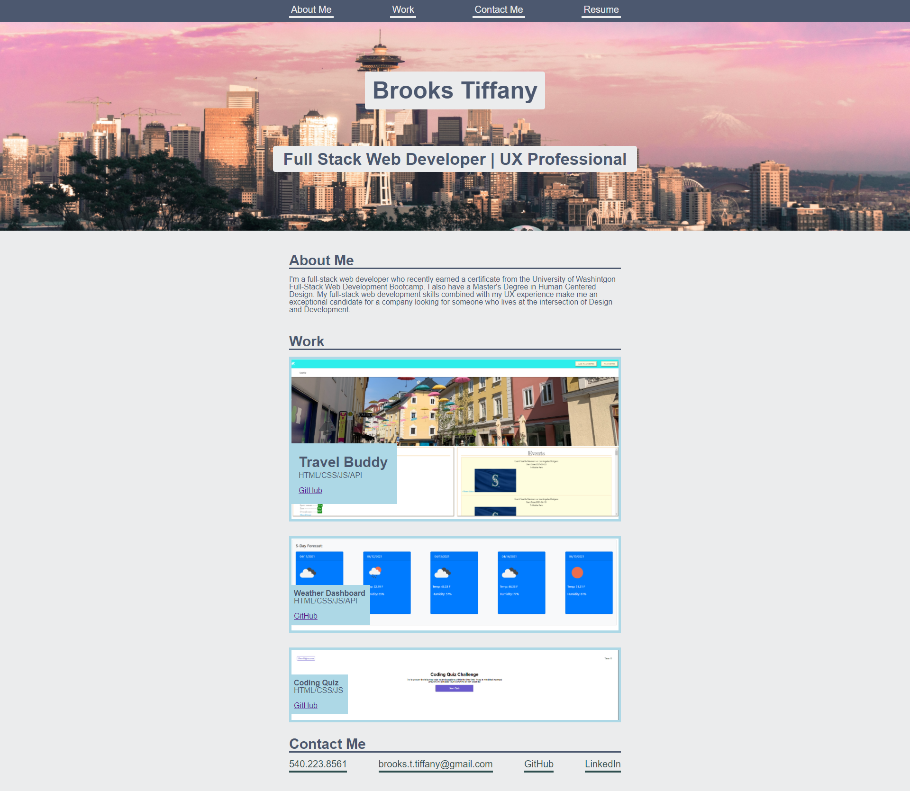

# professional-portfolio

## This portfolio is meant to showcase what I've learned so far in the UW COding Bootcamp. It's more of a placeholder for now as I'll continue to update and polish it before I show it to potential employers.

Link: https://brooks-t.github.io/professional-portfolio/

